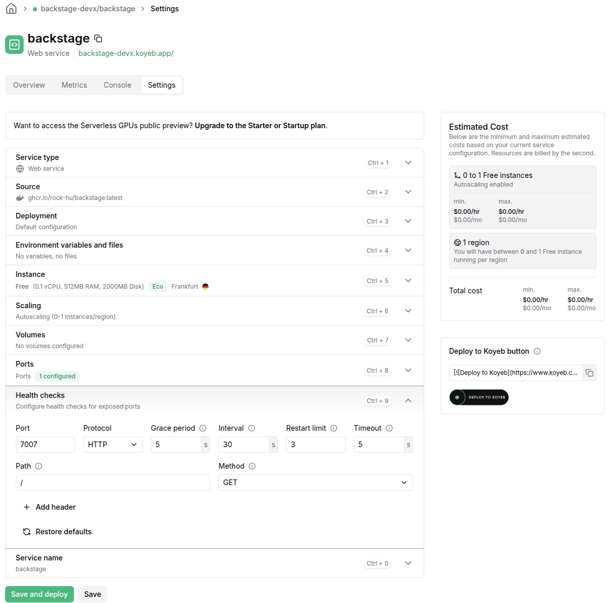

# devx

This is your newly scaffolded Backstage App, Good Luck!

To start the app, run:

```sh
yarn install
yarn start
```

```bash
yarn backstage-cli config:check --strict
```

```bash
yarn backstage-cli info > backstage.log
```

[Backstage](https://backstage-devx.koyeb.app/)

## badges

| artifact                   | badge                                                                                                                                                                                                           |
| -------------------------- | --------------------------------------------------------------------------------------------------------------------------------------------------------------------------------------------------------------- |
| backstage-build            | [](https://github.com/rock-hu/devx/actions/workflows/backstage-build.yaml)                                  |
| backstage-containerization | [](https://github.com/rock-hu/devx/actions/workflows/backstage-containerization.yaml) |
| koyeb-deploy               | [](https://github.com/rock-hu/devx/actions/workflows/koyeb-deploy.yaml)                                           |


## Token scopes

When creating a personal access token on GitHub, you must select scopes to define the level of access for the token. The scopes required vary depending on your use of the integration:

- Reading software components:
  - repo
- Reading organization data:
  - read:org
  - read:user
  - user:email
- Publishing software templates:
  - repo
- workflow (if templates include GitHub workflows)

## Action Modules

- Azure DevOps: @backstage/plugin-scaffolder-backend-module-azure
- Bitbucket Cloud: @backstage/plugin-scaffolder-backend-module-bitbucket-cloud
- Bitbucket Server: @backstage/plugin-scaffolder-backend-module-bitbucket-server
- Gerrit: @backstage/plugin-scaffolder-backend-module-gerrit
- Gitea: @backstage/plugin-scaffolder-backend-module-gitea
- GitHub: @backstage/plugin-scaffolder-backend-module-github
- GitLab: @backstage/plugin-scaffolder-backend-module-gitlab
- Rails: @backstage/plugin-scaffolder-backend-module-rails
- Yeoman: @backstage/plugin-scaffolder-backend-module-yeoman
- Sentry: @backstage/plugin-scaffolder-backend-module-sentry
- Cookiecutter: @backstage/plugin-scaffolder-backend-module-cookiecutter

## Kind

- Kind: Component: It is typically intimately linked to the source code that constitutes the component, and should be what a developer may regard a "unit of software", usually with a distinct deployable or linkable artifact.
- Kind: Template: A template definition describes both the parameters that are rendered in the frontend part of the scaffolding wizard, and the steps that are executed when scaffolding that component.
- Kind: API: The API can be defined in different formats, like `OpenAPI`, `AsyncAPI`, `GraphQL`, `gRPC`, or other `formats`.
- Kind: Group: A group describes an organizational entity,Members of these groups are modeled in the catalog as kind `User`.
- Kind: User: A user describes a person, such as an employee, a contractor, or similar. Users belong to `Group` entities in the catalog.
- Kind: Resource: A resource describes the infrastructure a system needs to operate
- Kind: System: A system is a collection of `resources` and `components`.
- Kind: Domain: A Domain groups a collection of systems that share terminology, domain models, business purpose, or documentation
- Kind: Location: A location is a marker that references other places to look for catalog data.

## GitHub Container Registry


## [Koyeb - GitHub Container Registry](https://www.koyeb.com/docs/build-and-deploy/private-container-registry-secrets#github-container-registry)




