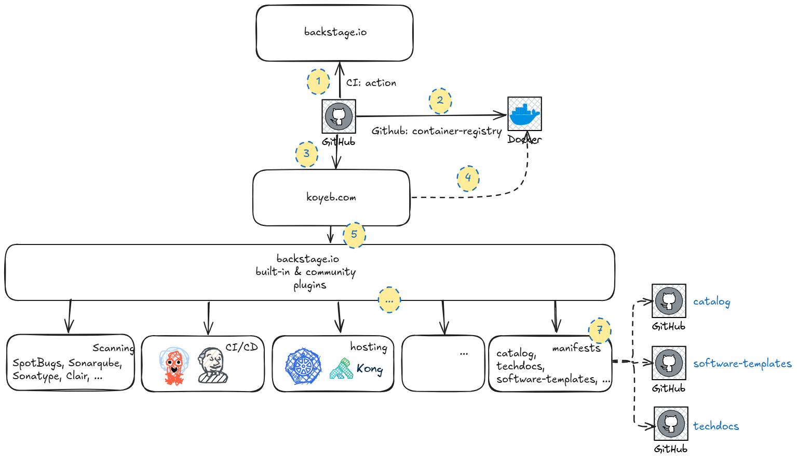
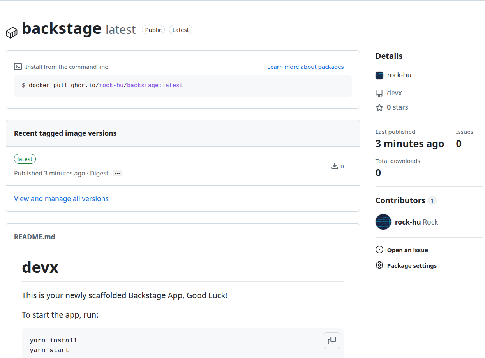

# devx

This is your newly scaffolded Backstage App, Good Luck!

To start the app, run:

```sh
yarn install
yarn start
```

## badges

| artifact                   | badge                                                                                                                                                                                                           |
| -------------------------- | --------------------------------------------------------------------------------------------------------------------------------------------------------------------------------------------------------------- |
| backstage-build            | [](https://github.com/rock-hu/devx/actions/workflows/backstage-build.yaml)                                  |
| backstage-containerization | [](https://github.com/rock-hu/devx/actions/workflows/backstage-containerization.yaml) |
| koyeb-deploy               | [](https://github.com/rock-hu/devx/actions/workflows/koyeb-deploy.yaml)                                           |



## Token scopes


When creating a personal access token on GitHub, you must select scopes to define the level of access for the token. The scopes required vary depending on your use of the integration:

- Reading software components:
  - repo
- Reading organization data:
  - read:org
  - read:user
  - user:email
- Publishing software templates:
  - repo
- workflow (if templates include GitHub workflows)

## Action Modules

- Azure DevOps: @backstage/plugin-scaffolder-backend-module-azure
- Bitbucket Cloud: @backstage/plugin-scaffolder-backend-module-bitbucket-cloud
- Bitbucket Server: @backstage/plugin-scaffolder-backend-module-bitbucket-server
- Gerrit: @backstage/plugin-scaffolder-backend-module-gerrit
- Gitea: @backstage/plugin-scaffolder-backend-module-gitea
- GitHub: @backstage/plugin-scaffolder-backend-module-github
- GitLab: @backstage/plugin-scaffolder-backend-module-gitlab
- Rails: @backstage/plugin-scaffolder-backend-module-rails
- Yeoman: @backstage/plugin-scaffolder-backend-module-yeoman
- Sentry: @backstage/plugin-scaffolder-backend-module-sentry
- Cookiecutter: @backstage/plugin-scaffolder-backend-module-cookiecutter

## GitHub Container Registry



## [Koyeb - GitHub Container Registry](https://www.koyeb.com/docs/build-and-deploy/private-container-registry-secrets#github-container-registry)


